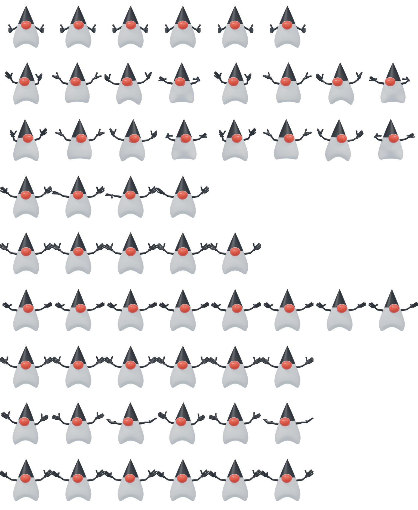

# Java Duke Codex Pet

Installed Codex pet package for Java Duke.

## Preview

## Contents

- `pet.json` - Codex pet manifest.
- `spritesheet.webp` - animated pet spritesheet.
- `validation.json` - validation report for the spritesheet.

## Pet metadata

- Pet ID: `java-duke`
- Display name: `Java Duke`
- Description: polished realistic 3D Codex pet rendered from the Java Duke Blender mascot model.
